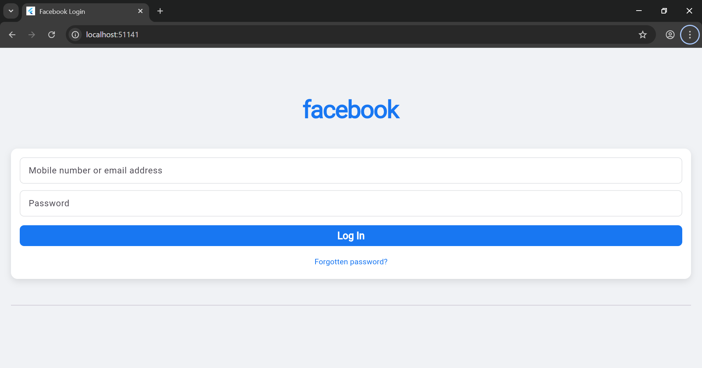
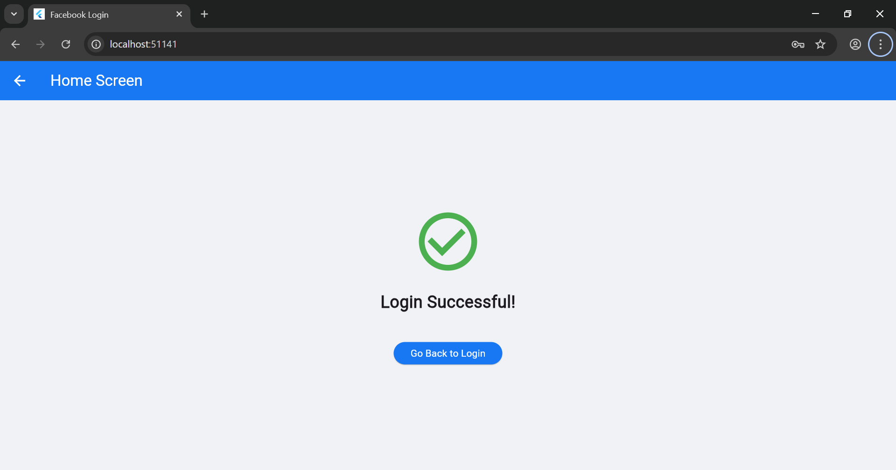

# Experiment 2: Activity & Navigation (Login Module)

## Student Information
* **Name:** Kartik Swami
* **Roll Number:** 23EACCS147
* **Batch:** Gamma-1
* **Course:** Computer Science Engineering
* **Experiment Title:** Experiment-2

---

## Aim
To understand widget navigation and create a login module using Flutter.

## Procedure
Flutter uses the **Navigator** class to manage app screens and transition between them. Login validation and input handling are performed using **TextEditingController**.

1. **Project Setup**: Created a new Flutter project and set up the directory structure for multiple screens.
2. **UI Design**: Developed a Facebook-style login page using `TextField`, `ElevatedButton`, and styling widgets.
3. **Controller Integration**: Used `TextEditingController` to capture and validate user input (email and password).
4. **Navigation Logic**: Implemented `Navigator.push` to navigate to the Home Page upon successful validation of credentials.
5. **Implementation**: Designed a simple Home Page to serve as the destination screen after a successful login.

### Output
The application successfully renders a Facebook login interface. Upon entering valid credentials and clicking login, the app navigates smoothly to the Home Page.

### Conclusion
By completing this experiment, I have successfully implemented screen navigation in Flutter and understood how to manage user input and validation using controllers within a login module.
